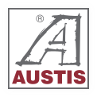

# AUSTIS Design System — Style Guide

Reference implementation: **AUSTIS Pozemní stavby** (`index.html`, `styles.css`, `script.js`).

The system is **static HTML + CSS + vanilla JS**, built around a fixed **1440px desktop artboard** that scales to the viewport.

---

## 1. Design philosophy

### Core idea

Industrial precision meets editorial restraint. The sites feel like **architectural drawings brought to life** — thin grid lines, measured spacing, numbered feature cards, and photography treated as structural material rather than decoration.

### Visual principles

| Principle | What it means in practice |
|-----------|---------------------------|
| **Grid as ornament** | 1px lines (`--grid`, semi-transparent) divide sections, frame content, and animate in on scroll. They are part of the brand, not just layout helpers. |
| **Glass over imagery** | Navigation, hero copy, and labels sit on frosted glass panels over full-bleed photos/video. Text stays readable without heavy opaque blocks. |
| **Accent geometry** | Small squares (7–14px) in brand red mark corners, bullets, and hover states. Consistent “construction mark” motif. |
| **Uppercase discipline** | Nav, buttons, eyebrows, feature titles, and stats labels are uppercase. Body copy stays sentence case. |
| **Weight contrast** | Headlines at 500, body at 300, labels at 700. Never use bold (700) for long paragraphs. |
| **Light page, dark anchors** | Page background is warm light grey (`#ebebeb`). Footer, CTA cards, and reference panels use `#000` / `--ink` for gravity. |

### Tone of voice (content)

- Direct, B2B, confidence without hype.
- Short lead sentences; supporting detail in muted secondary text.
- Czech language; company-specific tagline under logo in `logo-sub`.
- Primary CTA: **„poptat spolupráci“** (or equivalent per company).

---

## 2. Color palette

### CSS custom properties

```css
:root {
  --page-bg: #ebebeb;   /* Page canvas, grid dividers on white cards */
  --ink: #1e1e1e;      /* Primary text, dark buttons, dark CTA cards */
  --muted: #696a6d;    /* Secondary body text, logo subtitle bar */
  --grid: #b4b5b6;     /* Structural lines, card borders */
  --red: #932c38;      /* Brand accent */
}
```

### Semantic usage

| Token | Use |
|-------|-----|
| `--page-bg` | `body` background, internal grid lines on white panels, card borders |
| `--ink` | Headings on light sections, `.btn-dark`, dark CTA aside cards |
| `--muted` | Paragraphs, list items, company name in about section |
| `--grid` | Full-width section rules, service card borders, subpage borders |
| `--red` | Primary CTA (`.btn-red`), bullets, corner marks, hover accents, process step numbers |

### Fixed hex values (not tokenized)

| Value | Use |
|-------|-----|
| `#fff` | Card backgrounds, nav text on glass |
| `#000` | Footer fill, reference cards, contact dark cards, subpage bands |
| `rgba(217, 217, 217, 0.5)` | Hero/decorative lines (`.line`, `.grid-line`) |
| `rgba(105, 106, 109, 0.05)` | Subtle card shadows |
| `rgba(105, 106, 109, 0.72)` | Feature index numbers |
| `#7f2631` | `.btn-red` hover |
| `#343434` | `.btn-dark` hover |

### Glass surfaces

**Dark glass** (nav bar, hero copy, slide label):

```css
--glass-bg: linear-gradient(135deg, rgba(255,255,255,0.1) 0%, rgba(255,255,255,0.02) 42%, rgba(0,0,0,0.18) 100%), rgba(0,0,0,0.22);
--glass-blur: blur(20px) saturate(1.2);
--glass-border: rgba(255,255,255,0.14);
--glass-highlight: rgba(255,255,255,0.12);
--glass-shadow: 0 18px 40px rgba(0,0,0,0.12);
```

**Light glass** (project link tiles):

```css
--glass-light-bg: linear-gradient(135deg, rgba(255,255,255,0.58) 0%, rgba(255,255,255,0.34) 48%, rgba(235,235,235,0.4) 100%), rgba(235,235,235,0.36);
--glass-light-blur: blur(14px) saturate(1.15);
--glass-light-border: rgba(255,255,255,0.42);
--glass-light-highlight: rgba(255,255,255,0.72);
```

Always pair `backdrop-filter` with `-webkit-backdrop-filter` and `isolation: isolate` on the element.

### Photography treatment

```css
filter: saturate(0.96) contrast(1.05);  /* default hero/project images */
filter: saturate(0.92) contrast(1.04) brightness(0.82);  /* dimmed slides */
```

Hero uses a masked dark overlay (`::after` on `.hero`) — not a flat gradient over the whole image.

---

## 3. Typography

### Font stack

```css
font-family: "Neue Haas Grotesk Text Pro", "Helvetica Neue", Arial, sans-serif;
```

**Requirement:** License and host Neue Haas Grotesk Text Pro for production. Fallback stack is acceptable for dev only.

### Type scale

| Element | Size | Weight | Transform | Line-height |
|---------|------|--------|-----------|-------------|
| Hero `h1` | 27px | 500 | none | 1.4 |
| Section `h2` | 28–30px | 500 | none | 34–38px |
| Subpage `h1` | clamp(34px, 4vw, 54px) | 500 | none | 1.16 |
| Subpage `h2` | clamp(26px, 3vw, 36px) | 500 | none | 1.18 |
| Card `h3` / feature titles | 13–15px | 500 | uppercase | 1.18–1.4 |
| Body / lead | 15px | 300–500 | none | 1.45–1.6 |
| Small body | 13–14px | 300 | none | 1.45–1.55 |
| Nav / buttons | 15px | 500 | uppercase | — |
| Eyebrows | 12–13px | 700 | uppercase | letter-spacing 0.08–0.1em |
| Feature index `01` | 10px | 700 | none | letter-spacing 0.08em |
| Signal tags | 11px | 500 | uppercase | letter-spacing 0.07em |
| Stats labels | 12px | 700 / 400 | uppercase | — |
| Logo subtitle | 10px | 700 | uppercase | 10px |
| Footer copyright | 13px | — | none | letter-spacing 0.02em |

### Text color rules

- On **light backgrounds:** `--ink` for headings, `--muted` for body.
- On **glass / dark overlays:** `#fff` or `rgba(255,255,255,0.92)` body, `rgba(255,255,255,0.72)` eyebrows.
- On **black footer:** `rgba(255,255,255,0.66)` body, `#fff` for strong/highlight.

---

## 4. Layout system

### Desktop artboard

| Constant | Value | Notes |
|----------|-------|-------|
| Design width | `1440px` | `.artboard` fixed width |
| Content width | `1080px` (`--content-width`) | Main text/grid alignment |
| Content left offset | `(1440 - 1080) / 2 + 0.5px` | ~180px from artboard edge |
| Header offset | `50px` (`--header-offset`) | Top padding for header |
| Max scale width | `1920px` | JS caps scaling |
| Min scale | `0.5` | Prevent unreadable shrink |

Homepage sections are **`position: absolute`** inside `.artboard` — this is intentional for pixel-perfect Figma alignment. Subpages use **flow layout** (`.subpage-body`).

### Scaling (JavaScript)

`--scale` is computed from viewport width and height so the full hero fits above the fold:

```js
scale = min(width/1440, (height - 24) / heroPanelBottom, 1)
scale = clamp(scale, 0.5, 1)
```

Applied as:

```css
.artboard {
  transform: translateX(-50%) scale(var(--scale));
  transform-origin: top center;
}
```

### Subpage layout

| Property | Value |
|----------|-------|
| Max content width | `1174px` or `min(100% - 48px, 1174px)` |
| Section vertical rhythm | `88px` margin between blocks |
| Horizontal padding | `48px` |

Subpage body optional grid guides:

```css
background:
  linear-gradient(90deg, transparent … calc(50% - 587px), rgba(180,181,182,0.32) …),
  var(--page-bg);
```

---

## 5. Grid lines & decorative structure

### Line types

| Class family | Role |
|--------------|------|
| `.line` | Hero framing (nav rule, logo vertical, panel splits) |
| `.grid-line` | Internal white-panel grid (responsibility section) |
| `.section-line` | Full-bleed horizontal rules, service rails |
| `.footer-line` | Footer vertical/horizontal rules |

Base line style:

```css
background: rgba(217, 217, 217, 0.5);  /* hero */
background: var(--page-bg);             /* white panel interior */
background: var(--grid);                /* full-bleed rules */
```

### Animated lines (`.design-line`)

JS adds `design-line`, `is-horizontal` / `is-vertical`, and `is-line-visible`.

- **Draw:** `scaleX(0)` or `scaleY(0)` → `scale(1)` over 1050ms `cubic-bezier(0.16, 1, 0.3, 1)`
- **Shimmer:** `::after` pseudo travels along line after draw completes
- **Stagger:** Hero lines 55ms apart; section lines 75ms apart per parent

Sections `.project` and `.about` draw their own `::before`/`::after` lines on intersection.

### Red corner marks

Standard sizes:

| Context | Size |
|---------|------|
| Feature card hover corner | 11px → 18px on hover |
| CTA aside / about card | 11px fixed |
| Service rail squares | 11px |
| Project link hover | 14px → 32px |
| Subpage card accent bar | 11px × 72px left edge |
| Subpage band | 14px top-right |

---

## 6. Components

### Logo

```html
<a class="logo" href="#uvod" aria-label="[Company full name]">
  <span class="logo-mark">
    
  </span>
  <span class="logo-sub">[division tagline]</span>
</a>
```

| Property | Value |
|----------|-------|
| Mark size | 102×102px |
| Image overscan | 122×122 at -10px offset |
| Subtitle bar | `--muted` bg, white 10px uppercase text |

Large about logo: `logo b.svg`, ~286px, `clip-path: inset(10px)`.

### Navigation

- 5 items typical: Úvod, služby, reference, o společnosti, kontakt
- **Lowercase** link text in HTML (rendered uppercase via CSS)
- Active state: 1px bottom underline via `::after`, `scaleX(1)`
- Hover: underline grows from left, text fades to 82% white
- Sits on dark glass bar starting 101px right of logo column

### Buttons (`.btn`)

Fixed dimensions: **224×47px**.

| Variant | Background | Special |
|---------|------------|---------|
| `.btn-red` | `--red` | White 10×10 corner square `::after`; grows to 18px on hover |
| `.btn-dark` | `--ink` | Hover `#343434` |

Shared: uppercase, 15px/500, subtle shadow, lift shadow on hover.

### Project link tile (`.project-link`)

224×224px square. Light glass background. Dual-layer text swap on hover:

```html
<span class="project-link-text">
  <span class="project-link-ghost">line one<br />line two</span>
  <span class="project-link-visible">line one<br />line two</span>
</span>
```

Ghost layer is `--red`; visible fades out on hover while ghost fades in. Red corner mark scales up on hover. Use as `<a>` or `<button type="button">`.

### Feature card (`.feature-card`)

- White card, `--page-bg` border, numbered index top-left
- Grey 11px corner square (turns red on hover)
- Red 3px left bar grows to 48px height on hover
- Lifts 6px on hover with stronger shadow
- `h3` uppercase 13px; body 13px muted

### Responsibility / feature grid

Absolute-positioned mosaic inside 1080×583 panel. Header band 130px tall, centered title + lead. Dark CTA aside (`.responsibility-aside`) in grid cell with red corner.

### Service cards (`.service-card`)

- Image top: 378×465px
- Text block: 377×126px, white, left border `--grid`
- Hover: card lifts, image area unchanged, text block border turns red
- Three cards in horizontal row with vertical rail lines and red squares on rails

### Project / reference block (`.project`)

- Full bleed 1440×520
- Split imagery: left overflow image, dark overlay left portion, right image
- White copy block absolutely positioned over overlay
- Stats as bordered rows (label left, value right, uppercase 12px)
- Scope list: `li::marker { content: "■  "; }`
- Optional `.project-status` badge inline in title

### About section (`.about`)

- White card left (~665/953 of content width)
- Red corner on card
- Two sub-columns: „Náš přístup“ + „Zkušenosti“
- Experience list: `■` bullet via `::before`, 5px size
- Large logo + company name right column

### Footer (`.footer`)

- Black full-bleed background (`::before`)
- Two columns: Kontakt + Kariéra
- `.footer-roles` list with red square bullets and horizontal rules
- `.highlight` for IČ/DIČ
- Copyright `small` at 45% white opacity

### Subpage components

| Class | Purpose |
|-------|---------|
| `.subpage-header` | Logo + glass nav + CTA (flow layout) |
| `.subpage-hero` | Full-width image + bottom panel with red left bar |
| `.subpage-eyebrow` | Section label |
| `.subpage-card` | White bordered content card |
| `.subpage-band` | Black 2-column CTA/process band |
| `.reference-card` | Black split card (image + copy) |
| `.service-detail-card` | Image + text grid |
| `.contact-card` / `.contact-card-dark` | 3-column contact grid |
| `.subpage-footer` | Black closing CTA strip |

---

## 7. Motion & interaction

### Easing curves

| Name | Value | Use |
|------|-------|-----|
| Standard entrance | `cubic-bezier(0.16, 1, 0.3, 1)` | Lines, sections, hero stages |
| Smooth out | `cubic-bezier(0.22, 1, 0.36, 1)` | Image blend, project link text |
| Linear | `linear` | Ken Burns video scale |

### Durations

| Interaction | Duration |
|-------------|----------|
| Buttons, links | 220–260ms |
| Cards hover | 260–280ms |
| Section reveal | 760–820ms |
| Hero copy slide-up | 1100ms |
| Line draw | 1050ms |
| Video → still blend | 720ms |
| Image crossfade | 360ms |

### Hero choreography (homepage)

Class progression on `.hero-is-choreo`:

1. `hero-is-ready` — assets loaded, video plays
2. `hero-stage-lines` — grid lines draw, side panel sweeps in
3. `hero-stage-header` — logo, nav, CTA stagger in
4. `hero-stage-label` — project name label slides in
5. `hero-stage-copy` — copy panel rises from below
6. `hero-stage-copy-detail` — h1, paragraph, signals fade up; shine sweep
7. `hero-stage-emphasis` — (timing hook)
8. `hero-is-settled` — video freezes, crossfades to still poster
9. `hero-stage-responsibility` — next section reveals

Stages sync to **video `currentTime / duration`** with fallback timer if autoplay blocked.

Required assets before reveal: window load, fonts ready, video buffered, still image loaded, logo images loaded.

### Scroll-triggered animation

`IntersectionObserver` with roughly:

- Lines: `rootMargin: 0 0 -18% 0`, `threshold: 0.08`
- Responsibility section: triggered from hero choreography end (+780ms delay)
- Nav active state: `rootMargin: -28% 0 -58% 0`

### Hover policy

All meaningful hovers wrapped in:

```css
@media (hover: hover) and (pointer: fine) { … }
```

### Reduced motion

`@media (prefers-reduced-motion: reduce)` must:

- Skip hero video animation; show still immediately
- Force all choreo stages to final state
- Disable line draw, shimmer, Ken Burns
- Remove hover transforms
- Keep color/opacity hovers that aid clarity (project link ghost swap)

---

## 8. Homepage structure

Recommended section order inside `.artboard`:

```
1. .hero          — Video/still, header, project label, copy + project-link
2. .line-hero-left — Vertical connector (sibling, not inside hero)
3. .responsibility — Feature grid + dark CTA
4. .services      — Three service cards + rails
5. .project       — Reference showcase + carousel
6. .about         — Company intro + logo
7. .footer        — Contact + careers
```

Each section has explicit `top` calculated from `--layout-shift` (currently `86px - --header-offset`). When changing header height, update `--header-offset` and dependent variables together.

---

## 9. Subpages

Expected pages (per `build.mjs`):

| File | Purpose |
|------|---------|
| `index.html` | Homepage |
| `sluzby.html` | Services detail |
| `reference.html` | Full reference list |
| `o-spolecnosti.html` | Company page |
| `kontakt.html` | Contact |

Subpage shell:

```html
<body class="subpage-body">
  <main class="subpage-site">
    <header class="subpage-header">…</header>
    <section class="subpage-hero">…</section>
    <section class="subpage-section">…</section>
    <!-- optional .subpage-band -->
    <footer class="subpage-footer">…</footer>
  </main>
</body>
```

Subpages **do not** use artboard scaling or hero choreography. Reuse header, buttons, cards, typography tokens.

---

## 10. Imagery guidelines

### Hero

- Prefer **short looped MP4** (muted, `playsinline`, `preload="auto"`) + **poster PNG** for still settle.
- Stack: `.hero-bg-video` under `.hero-bg-still` in `.hero-bg-stack`.
- Optional per-project framing classes: `.is-seibert-framed`, `.is-top-framed`, `.is-vranany-framed`, `.is-novo-framed` — adjust `object-position` / `scale` per asset.

### Service / card images

- Portrait ~4:5 ratio (378×465).

### Project split

- Left image bleeds off-canvas (`left: -367px`) for depth.
- Right image fills right column; dark overlay on left 664px.

### File organization

```
/
├── logo.svg          # Nav mark
├── logo b.svg        # Large about/footer mark
├── assets/           # Photography, video
├── index.html
├── sluzby.html
├── reference.html
├── o-spolecnosti.html
├── kontakt.html
├── styles.css        # Shared stylesheet
└── script.js         # Shared interactions
```

---

## 11. Accessibility

- `lang="cs"` on `<html>`
- Meaningful `aria-label` on sections and icon-only controls
- `aria-current="page"` on active nav link
- `aria-live="polite"` on dynamic reference copy
- Video: `muted`, descriptive `aria-label`
- Focus: `outline: 1px solid currentColor; outline-offset: 5px`
- Don’t rely on color alone — red squares accompany red text accents

---

## 12. Tech stack & build

- **No framework** — vanilla HTML/CSS/JS
- **Build:** `node build.mjs` copies HTML, CSS, JS, `assets/`, and root images to `public/`
- **Deploy:** Vercel (`vercel dev` for local)
- **Single shared** `styles.css` + `script.js` across all pages

---

## 13. Customization checklist

### Must change per company

- [ ] `logo.svg`, `logo b.svg`
- [ ] `logo-sub` tagline text
- [ ] `--red` if brand accent differs
- [ ] All copy, meta description, `<title>`
- [ ] Hero video, poster, project label
- [ ] Service images and titles
- [ ] `referenceProjects` array in `script.js`
- [ ] Contact details (IČ, DIČ, address, roles)
- [ ] `aria-label` strings with company name
- [ ] Nav `href` targets if page structure differs

### Keep consistent

- [ ] Font family and type scale
- [ ] Layout widths (1440 / 1080 / 1174)
- [ ] Component class names and HTML patterns
- [ ] Glass recipes and grid line behavior
- [ ] Button dimensions and uppercase style
- [ ] Motion timings and choreo stage order
- [ ] Footer structure (Kontakt + Kariéra columns)

### Verify before launch

- [ ] Hero choreo completes on desktop
- [ ] Reduced motion path shows content immediately
- [ ] Scale never clips hero above fold at 1280×720 and 1920×1080
- [ ] All five HTML files pass build.mjs
- [ ] Glass readable on all hero images
- [ ] Focus states visible on nav, buttons, project links
- [ ] Reference carousel preloads images

---

## 14. Quick reference — HTML snippets

### Red-signal tag

```html
<div class="hero-signals">
  <span>benefit one</span>
  <span>benefit two</span>
</div>
```

### Feature card

```html
<article class="feature-card one">
  <span class="feature-index" aria-hidden="true">01</span>
  <i></i>
  <h3>Title in uppercase</h3>
  <p>Supporting copy in muted tone.</p>
</article>
```

### Service card

```html
<article class="service-card service-one">
  
  <div>
    <h3>Service name</h3>
    <p>Short description.</p>
  </div>
</article>
```

### Eyebrow (subpage)

```html
<span class="subpage-eyebrow">Section label</span>
```

### Stats row (reference)

```html
<div class="stats">
  <div><strong>Label</strong><span>Value</span></div>
</div>
```

---

## 15. Design tokens summary

Copy-paste starter `:root` block:

```css
:root {
  /* Brand */
  --page-bg: #ebebeb;
  --ink: #1e1e1e;
  --muted: #696a6d;
  --grid: #b4b5b6;
  --red: #932c38;

  /* Glass dark */
  --glass-bg: linear-gradient(135deg, rgba(255,255,255,0.1) 0%, rgba(255,255,255,0.02) 42%, rgba(0,0,0,0.18) 100%), rgba(0,0,0,0.22);
  --glass-blur: blur(20px) saturate(1.2);
  --glass-border: rgba(255,255,255,0.14);
  --glass-highlight: rgba(255,255,255,0.12);
  --glass-shadow: 0 18px 40px rgba(0,0,0,0.12);

  /* Glass light */
  --glass-light-bg: linear-gradient(135deg, rgba(255,255,255,0.58) 0%, rgba(255,255,255,0.34) 48%, rgba(235,235,235,0.4) 100%), rgba(235,235,235,0.36);
  --glass-light-blur: blur(14px) saturate(1.15);
  --glass-light-border: rgba(255,255,255,0.42);
  --glass-light-highlight: rgba(255,255,255,0.72);
  --glass-light-bg-hover: linear-gradient(135deg, rgba(255,255,255,0.76) 0%, rgba(255,255,255,0.5) 48%, rgba(255,255,255,0.38) 100%), rgba(255,255,255,0.46);

  /* Layout */
  --scale: 1;
  --header-offset: 50px;
  --content-width: 1080px;
  --content-left: calc((1440px - var(--content-width)) / 2 + 0.5px);
  --content-right: calc(var(--content-left) + var(--content-width) - 1px);
}
```

---

*Document version: 1.1 — derived from AUSTIS Pozemní stavby, June 2026.*
